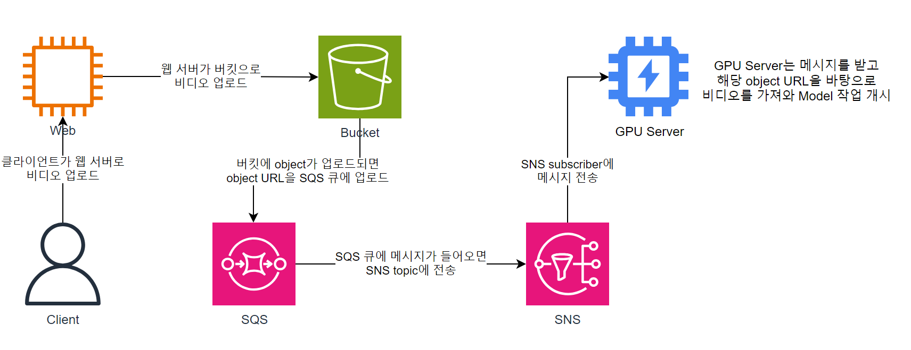

# GAMST-model-workflow
Generative Assistant Model framework for Surveillance and Threat detection - model workflow

## 워크플로 아키텍쳐


## Usage
```
# make .env file manually
touch .env

# Build docker image
docker build . -t gamst-model-workflow

# Run container
docker run -d -p 8505:5000 --name gamst-model-workflow gamst-model-workflow
```